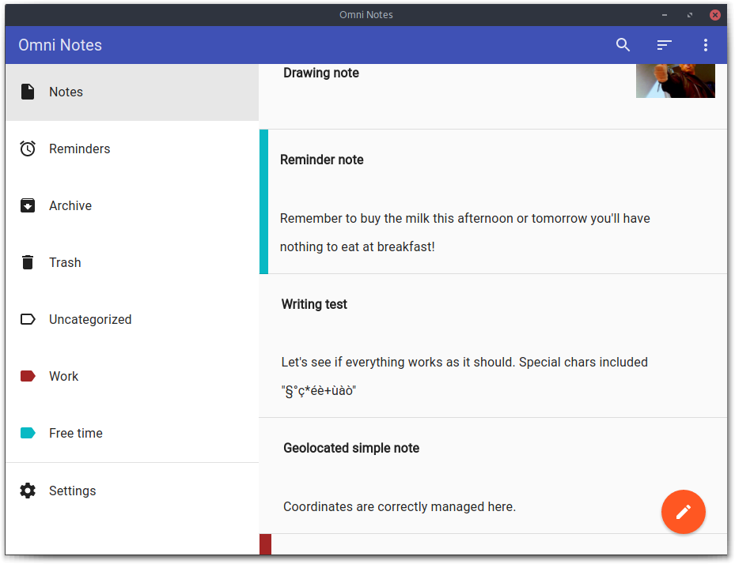

# Omni Notes Desktop



This is the official desktop counterpart of the Android open-source note-taking app [Omni Notes](https://github.com/federicoiosue/Omni-Notes)

## Compatibility

The application is cross-platform and runs on Linux, Windows and Mac.

It currently has no backend and just uses JSONs to store and read data. So, **no sync is supported**, if you want to keep data updated through different platforms you have to use third-party synchronization applications.

## Environment

```npm install jquery angular angular-route angular-material angular-animate angular-aria angular-material-icons underscore angular-local-storage```

## Developed with love and passion by
* Federico Iosue - [Website](http://www.iosue.it/federico)

## License
The application is licensed under [GPL3](LICENSE.md) so, if you want to use it fully or any part of it you **have to** release the source code.
